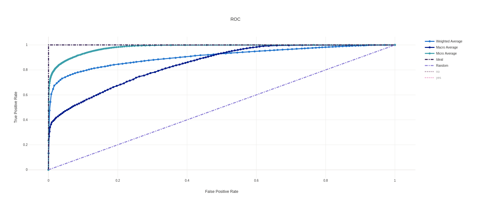

# Optimizing an ML Pipeline in Azure

## Overview
This project is part of the Udacity Azure ML Nanodegree.
In this project, we build and optimize an Azure ML pipeline using the Python SDK and a provided Scikit-learn model.
This model is then compared to an Azure AutoML run.

## Summary
This dataset contains client data from a bank including client data (age, job, marital status, education...), 
information regarding last contact of the current campaign, and social and economic context. 
We are trying to predict whether the client subscribed to a term deposit

## Scikit-learn Pipeline
Pipeline architecture is as below:

input data -> train/test split -> classification algorithm ( Scikit Learn ) ->  Hyper Parameter Tuning ( Regularisation Strength, and max iter are searched )
-> find model that has max accuracy
Regularisation strength is selected from a uniform distribution between 0.0 and 1.0
Max Iter is selected from a uniform distribution between 100 and 2000, rounded to the nearest integer

Random Parameter Sampling was employed which delivers results much faster than grid sampling due to limiting the search space.

Bandit policy was utilized as the early stopping policy. 
Runs are terminated if the accuracy is below max primary metric scaled by a slack factor.
This policy helps speed up the overall time spent seaching for best model.

# AutoML
Below parameters were employed for automl configuration 
```
    experiment_timeout_minutes=15,
    task= 'classification', # indicates what is the prediction task
    primary_metric='accuracy', # this is the metric that automl optimizes for
    training_data=x, 
    label_column_name='y',
    n_cross_validations=2  # when validation data is not provided, azure ml uses this paramter as the number of cross validations during training

```

Voting Ensemble was determined as the best performing model by automl with acn accuracy of 0.9159.

### ROC Curve



## Pipeline comparison
Automl generated model performed slightly better than the hyperdrive config with accuracy of 0.9159.
The reason for AutoML is likely be due to a larger hyperparameter and algorithm search space when compared to hyperdrive run.
A single pipeline and only 2 hyper parameters were controlled during the hyperdrive config run whereas automl tried nearly 20 different pipelines.

## Future work
Automl can be run for a longer time to potentially find better models. 
Ideally, a metric such as F1 score could be employed for comparison rather than accuracy for better understanding the 
performance of these algorithms when predicting parameters other than true positives.
Trying a larger set of hyperparameters could help improve the performance of hyperdrive config run. 
Hyperdrive config run would also benefit from trying various pipelines with different scaling methods and classification algorithms.

#### Why these suggestions would improve models?
Running Automl for a longer duration would allow automl to investigate more pipelines and hyper parameters which might have better performance compared to the
model found during limited search time. Increasing the runtime would incur a larger cost.
Employing a Score such as F1 would improve the actual model performance on other classification aspects such as precision, recall rather than
just optimising for accuracy.
Using a larger set of hyperparameters during the hyperdrive config would increase the search space for parameters that direclty effect 
model performance.
Different pipelines with various normalisation, scaling approaches would help hyperdrive config run 
since if the data is not normalised properly, gradients would take a long time oscillating back and forth before finding global/local minimum.
There seems to be a data bias towards negative cases: balancing the classes in input data would help avoid bias on model